# Get What U Need — Bad Trip Edition v1.1.1

Un endless runner 2D dark & gritty où vous devez fuir dans la rue, collecter de la weed pour survivre, et éviter la police à tout prix.

---

## 🎮 Contrôles

| Touche | Action |
|--------|--------|
| **Flèche Haut / Espace** | Sauter |
| **Flèche Bas** | Descendre vite (en l'air) |
| **P / Echap** | Pause |
| **F11** | Plein écran / Mode fenêtré |

### Touches de débogage (cheat)

| Touche | Effet |
|--------|-------|
| **K** | God Mode (invincible + vol) |
| **G** | +1000 crédits |
| **H** | Afficher les hitboxes |

---

## 💊 Mécanique centrale : Addiction

L'addiction est le cœur du jeu. Une barre en haut à gauche du HUD monte **continuellement** avec le temps.

  

- À **100%** → **MANQUE** : game over immédiat
- Au-dessus de **50%** → votre personnage ralentit et marche au lieu de courir
- **Collecter de la weed** réduit le manque de 15 points à chaque prise

**Objectif simple : ne jamais laisser la barre se remplir.**

---

## ❤️ Les éléments du jeu

### Vie (cœurs)

Vous avez **3 cœurs**. Vous en perdez un si vous vous heurtez à un ennemi (sans bouclier). À 0 cœur → **WASTED**.

  

Après un coup reçu, vous êtes **invincible pendant 60 frames** (le personnage clignote). Profitez de cette fenêtre pour vous dégager.

---

### 👾 Ennemis

#### Rats
Courent au sol — **Sauter dessus (stomp) pour les tuer**

  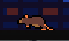

#### Oiseaux
Volent vers vous horizontalement — **Sauter dessus ou utiliser le bouclier**

  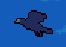

#### Loup / Ours
Mobs au sol, plus grands et plus rapides — **Apparaissent en forêt**

  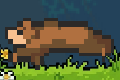

#### Drones
Apparaissent après 5000m, plongent sur vous — **Détruisez-les avec le bouclier**

  

#### 🚔 Police
Vous poursuit depuis derrière — **AUCUNE ISSUE** : s'il vous touche, vous êtes **ARRÊTÉ** (game over)

  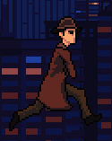
  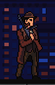

---

### 🚧 Obstacles

Les **tas de déchets** au sol vous ralentissent à 50% de vitesse si vous y courez. Le bouclier les détruit.

  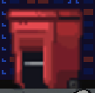
  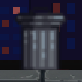
  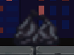

---

### 🎁 Collectibles

#### Weed
Réduit le sevrage de 15

  

#### Cœur
Restaure 1 cœur

  

#### Bouclier
Détruit ennemis et obstacles pendant 20 secondes

  

#### Magnet
Attire le weed dans un rayon de 400px pendant 20 secondes

  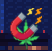

---

## 🔥 Le Combo

Chaque **stomp** (saut sur la tête d'un ennemi) incrémente votre combo. Le compteur apparaît à l'écran dès que vous êtes à 2x ou plus. Le combo se réinitialise si vous subissez des dégâts.

  

Les combos sont utiles pour compléter les missions et scorer plus de points.

---

## 🌍 Les Biomes

Le monde défile en boucle à travers **4 biomes** qui changent tous les ~400 mètres :

### Rue
Ville nocturne, déchets, lampadaires

  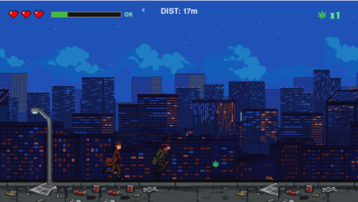

### Parc
Vert, plus calme

### Forêt
Plus d'oiseaux, loups et ours apparaissent

  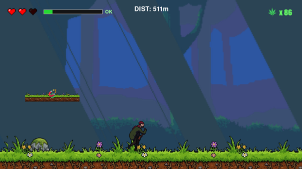

### Toits
Danger élevé, drones plus fréquents

---

## 📈 Difficulté progressive

- Votre vitesse de base augmente avec la distance parcourue
- Les **drones** n'apparaissent qu'après **5000 mètres**
- Au-delà de 50 000m, un multiplicateur de vitesse atteint +60%

---

## 🛍️ Menus & Progression

### Boutique

Vous pouvez acheter des **skins de personnage** avec vos crédits. Les crédits se gagnent en complétant les missions ou en vendant du weed (1 weed = 8 crédits via le bouton "Sell Weed").

  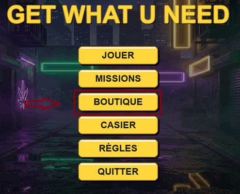

  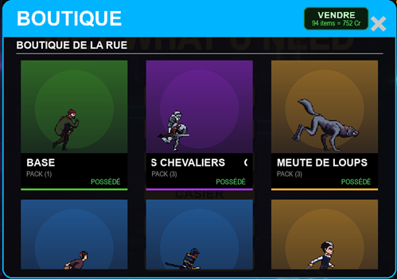

### Casier

Tous les skins achetés sont listés ici. Sélectionnez un set puis une variante pour l'équiper.

  

  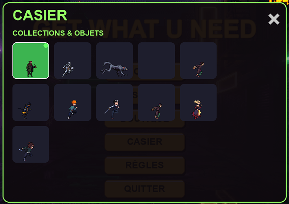

### Missions

À chaque nouvelle partie, 3 missions sont générées aléatoirement (collecter du weed, parcourir une distance, tuer des rats, etc.). Complétez-les pour gagner des crédits. Une fois réclamée, une nouvelle mission la remplace.

  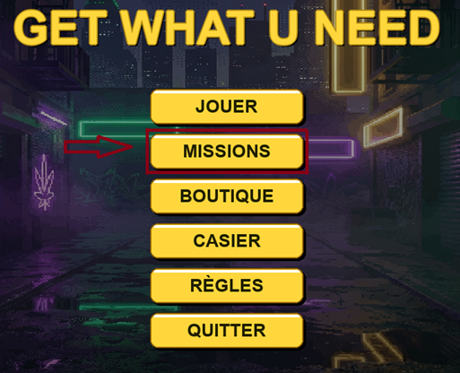

  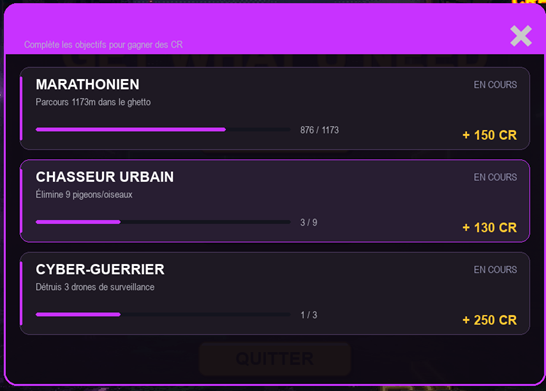

---

## 🎓 Petit Tuto : Votre Première Partie

**1. Lancez une partie**  
Dans le menu principal, cliquez sur **JOUER**.

**2. Regardez votre addiction**  
En haut à gauche, vous verrez la barre d'addiction. Elle commence à monter dès le début. Gardez un œil dessus en permanence.

**3. Courez et sautez**  
Quand vous voyez un obstacle ou un ennemi devant vous, sautez avec la flèche haut.

**4. Collectez de la weed**  
Les objets qui flottent sur le chemin (weed par défaut, ou un autre selon votre skin) sont vos sauvegardes. Chaque prise réduit le manque de 15. Ne les ignorez pas.

**5. Faites des stomps**  
Quand vous voyez un rat ou un oiseau, sautez **sur sa tête**. Vous rebondirez (bounce) et tuerez l'ennemi en même temps. C'est la meilleure façon de gérer les mobs sans perdre de vie.

**6. Évitez la police**  
La police vous suit depuis derrière. Elle ne peut pas vous rattraper si vous restez en mouvement, mais ne vous arrêtez jamais trop longtemps.

**7. Réclamez vos missions**  
Après une partie (même si vous mourrez), allez dans **MISSIONS** pour voir si vous avez complété des objectifs. Réclamez les récompenses pour accumuler des crédits.

**8. Explorez le magasin**  
Une fois que vous avez assez de crédits, rendez-vous dans la **BOUTIQUE** pour débloquer un nouveau skin. Vendez d'abord votre weed stocké pour vous remplir les poches.

---

## ☠️ Causes de game over

| Message | Raison |
|---------|--------|
| **WASTED** | Plus de cœurs |
| **MANQUE** | Le manque a atteint 100% |
| **ARRESTED** | La police vous a rattrapé |

---

## 💡 Conseils

- Le **bouclier** est votre ami : il détruit tout sur son passage. Utilisez-le quand la situation est chaotique
- Le **magnet** vous permet de collecter de la weed sans vous exposer. Très utile quand le manque monte vite
- Dans la **forêt**, faites attention : les loups et ours sont plus gros et plus rapides
- Les **drones** n'apparaissent qu'après 5000m. Prenez le temps de vous installer avant
- Si vous êtes ralenti par des déchets, utilisez le saut pour reprendre de la vitesse
